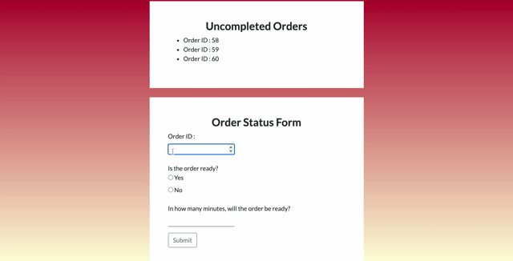
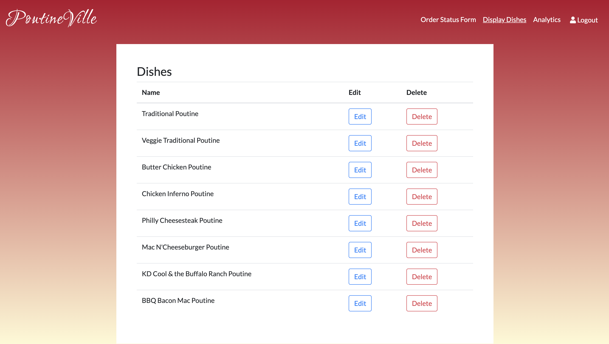
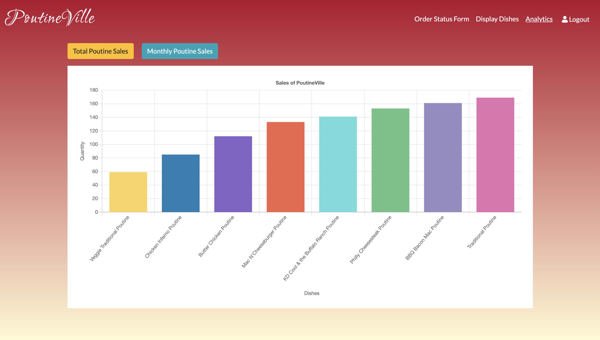

# PoutineVille
## Project Description
A food ordering website for a single restaurant. Customers can visit the website and select one or more dishes and place an order for pick-up.

When an order is placed, the owner is notified by SMS. The owner can then log into the admin site and specify how long the order will take. When the order is ready, a SMS is sent to the customer.

In the admin site, the owner can view analytics about the restaurant such as the total number of orders per month and how many times each dish has been ordered. The owner can also update the menu by editing or deleting dishes.

## Product

Responsive design


Intructions pop-up


Empty cart notification


Order submission notification


Owner SMS and Customer SMS

<p>
    
    
</p>

Admin Updating Order Status



Admin menu update



Admin analytics




## Contributors

* Adel Rashed [(GitHub: AdelRashed97)](https://github.com/AdelRashed97)
* Maribelle Leong [(GitHub: malaibao)](https://github.com/malaibao)
* Erica Sun [(GitHub: ericasun2000)](https://github.com/ericasun2000)

## Tech Stack
1. HTML5
2. CSS3
3. NodeJS
4. EJS
5. JQuery
6. Bootstrap4
7. PSQL
8. Twilio API

## Getting Started

1. Create the `.env` by using `.env.example` as a reference: `cp .env.example .env`
2. Update the .env file with your correct local information 
    - username: `labber` 
    - password: `labber` 
    - database: `midterm`
3. Install dependencies: `npm i`
4. Fix to binaries for sass: `npm rebuild node-sass`
5. Reset database: `npm run db:reset`
6. Run the server: `npm run local`
7. Visit `http://localhost:8080/`

## Twilio Setup
1. Sign up for a Twilio account and get a trial phone number. Save the phone number, SID and Auth Token into the `.env` file.
````
TWILIO_SID='the SID'
TWILIO_AUTHTOKEN='the Auth Token'
TWILIO_NUMBER='the Twilio phone number'

````
2. Enter a number as the owner phone number in the `.env` file
````
TWILIO_OWNER='your phone number including the country code and area code'
````

## Dependencies

- Node 10.x or above
- NPM 5.x or above
- PG 6.x
- body-parser
- cookie-session
- dotenv
- ejs
- express
- morgan
- twilio

## Dev Dependency
- nodemon
